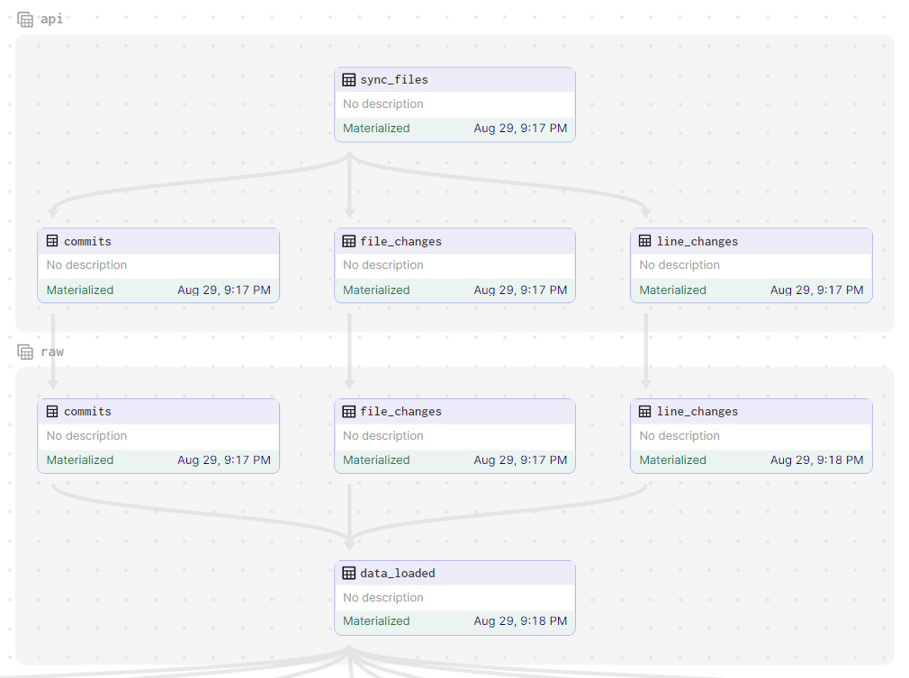

# dagster_github_metrics

Integrate dbt and clickhouse with `dagster`.It a continue of the previous project ["clickhouse-dbt"](https://github.com/Kushalkhadka7/clickhouse-dbt). In this project `dagster` is used to orchestrate the data pipeline.

The pipeline fetches csv data files from s3 buckets and stores those files in local filesystem. Once the files are downloaded we extract the data from csv files and load them to `clickhouse-server` raw database `(rz_github_metrics)`.

After the data is loaded to raw zone, transformation pipeline executes `dbt_project` and transforms the data and load the transformed data into standard
transformed zone `(sz_github_metrics)`.

## Workflow diagram


## Pipeline diagram


## Requirements

| Name           | Version |
| -------------- | ------- |
| docker         | >= 20   |
| docker-compose | >= 2    |
| virtualenv     | >= 20   |

> **_NOTE :_** Before running this project. The clickhouse-server should be up and running from this project ["clickhouse-dbt"](https://github.com/Kushalkhadka7/clickhouse-dbt). Also, all of the migrations should be executed, but the data loading part is skipped since the loading and transformation of the data will be orchestrated by dagster.

## Getting started

First, install your Dagster code location as a Python package. By using the --editable flag, pip will install your Python package in ["editable mode"](https://pip.pypa.io/en/latest/topics/local-project-installs/#editable-installs) so that as you develop, local code changes will automatically apply.

```bash
make dagster-env

# Make local env ready to run dagster project.
```

This will create a virtualenv with all of the required dependencies installed and ready to run dagster locally.

Then make a copy of `.env.example` file to `.env` and update the credentials accordingly.

After that, start the Dagster UI web server:

```bash
make dagster-dev

# Run dagster server.
```

Open http://localhost:3000 with your browser to see the project.

Navigate to assets and materialize the assets.

## Deploy on Dagster Cloud

The easiest way to deploy your Dagster project is to use Dagster Cloud.

Check out the [Dagster Cloud Documentation](https://docs.dagster.cloud) to learn more.

## Additional Pipeline diagram



